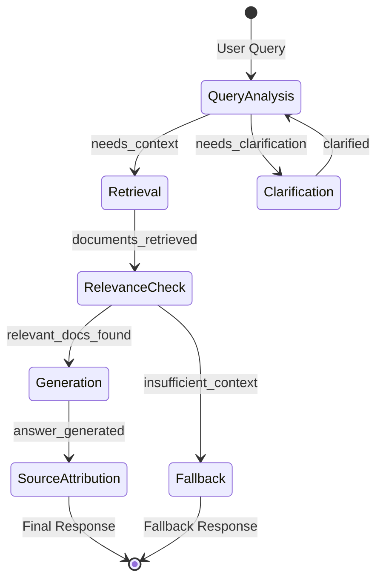
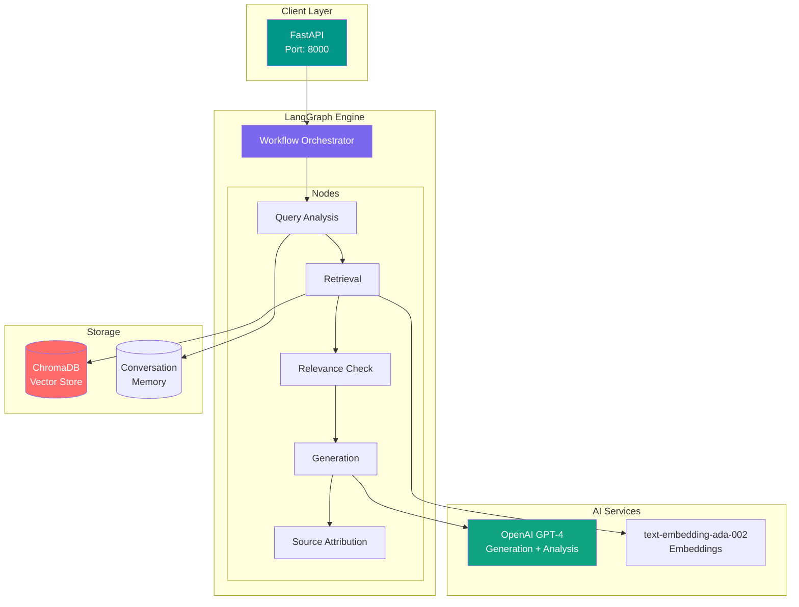
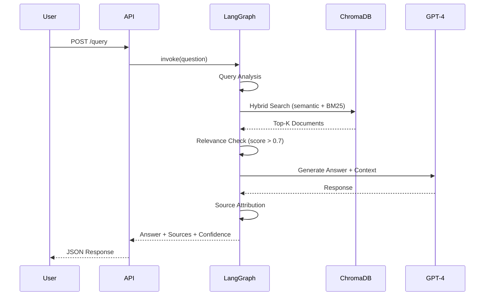

# LangGraph RAG Assistant

[](https://github.com/morgandt-reed/langgraph-rag-assistant/actions/workflows/ci.yml)
[](https://opensource.org/licenses/MIT)
[](https://www.python.org/)

Enterprise-ready Retrieval Augmented Generation (RAG) system with LangGraph multi-step reasoning workflows for technical documentation querying.

## Demo


*FastAPI Swagger UI for testing RAG queries*

<details>
<summary>View more screenshots</summary>

### Query Response with Sources


### Document Ingestion


</details>

## Architecture

### LangGraph State Machine



### System Architecture



### RAG Pipeline Flow



## Features

- **LangGraph State Machine**: Multi-step reasoning with conditional routing
- **Smart Retrieval**: Hybrid search (semantic + keyword) with reranking
- **Source Attribution**: Every answer includes document references with page numbers
- **Conversation Memory**: Context-aware multi-turn conversations
- **Streaming Responses**: Token-by-token output for better UX
- **Docker Deployment**: Fully containerized with docker-compose
- **FastAPI Backend**: Production-ready REST API
- **Quality Checks**: Confidence scoring and fallback handling

## Tech Stack

- **Framework**: LangChain 0.1.0+ & LangGraph 0.0.20+
- **LLM**: OpenAI GPT-4 (configurable)
- **Vector DB**: ChromaDB (easily swappable to Pinecone/Weaviate)
- **Embeddings**: OpenAI text-embedding-ada-002
- **API**: FastAPI 0.104+
- **Deployment**: Docker + Docker Compose

## Project Structure

```
.
├── README.md
├── docker-compose.yml
├── Dockerfile
├── requirements.txt
├── .env.example
├── app/
│   ├── main.py                      # FastAPI application
│   ├── graph/
│   │   ├── workflow.py              # LangGraph state machine
│   │   ├── nodes.py                 # Graph nodes (retrieval, generation, etc.)
│   │   └── state.py                 # Graph state definition
│   ├── ingestion/
│   │   ├── loader.py                # Document loading (PDF, MD, TXT)
│   │   ├── chunker.py               # Text splitting strategies
│   │   └── embeddings.py            # Vector embedding generation
│   ├── retrieval/
│   │   ├── vector_store.py          # ChromaDB integration
│   │   └── reranker.py              # Cross-encoder reranking
│   └── api/
│       ├── routes.py                # REST endpoints
│       └── schemas.py               # Pydantic models
├── notebooks/
│   └── demo.ipynb                   # Interactive demonstration
├── sample-docs/
│   └── technical-docs/              # Sample documentation files
├── config/
│   ├── config.yaml                  # LLM settings, chunking params
│   └── prompts.yaml                 # Prompt templates
└── tests/
    ├── test_graph.py
    └── test_retrieval.py
```

## Quick Start

### Prerequisites

- Docker 20.10+
- Docker Compose 2.0+
- OpenAI API key

### Setup

1. **Clone the repository**
```bash
git clone <your-repo-url>
cd langgraph-rag-assistant
```

2. **Configure environment**
```bash
cp .env.example .env
# Edit .env and add your OPENAI_API_KEY
```

3. **Start the application**
```bash
docker-compose up -d
```

4. **Ingest documents**
```bash
# Upload your documents to sample-docs/technical-docs/
# Then run ingestion
curl -X POST http://localhost:8000/ingest
```

5. **Query the assistant**
```bash
curl -X POST http://localhost:8000/query \
  -H "Content-Type: application/json" \
  -d '{"question": "How do I configure authentication?"}'
```

### Access Services

- **API**: http://localhost:8000
- **API Docs**: http://localhost:8000/docs
- **Health Check**: http://localhost:8000/health

## API Endpoints

### POST /query
Ask a question and get an answer with sources.

```bash
curl -X POST http://localhost:8000/query \
  -H "Content-Type: application/json" \
  -d '{
    "question": "What are the deployment options?",
    "session_id": "user123",
    "stream": false
  }'
```

**Response:**
```json
{
  "answer": "There are three main deployment options: Docker, Kubernetes, and serverless...",
  "sources": [
    {
      "document": "deployment-guide.pdf",
      "page": 5,
      "relevance_score": 0.92,
      "excerpt": "Docker deployment is the recommended..."
    }
  ],
  "confidence": 0.89,
  "conversation_id": "conv_xyz123"
}
```

### POST /ingest
Ingest new documents into the vector store.

```bash
curl -X POST http://localhost:8000/ingest
```

### GET /health
Health check endpoint.

## LangGraph Workflow

The assistant uses a multi-step reasoning workflow:

### 1. Query Analysis Node
- Analyzes user intent
- Determines if retrieval is needed
- Checks for clarification requirements

### 2. Retrieval Node
- Performs hybrid search (semantic + keyword)
- Retrieves top-k relevant documents
- Applies optional reranking

### 3. Relevance Check Node
- Validates retrieved context quality
- Routes to generation or fallback
- Calculates confidence score

### 4. Generation Node
- Generates answer using LLM
- Grounds response in retrieved context
- Maintains conversation history

### 5. Source Attribution Node
- Extracts and formats source citations
- Adds page numbers and relevance scores
- Ensures transparency

## Configuration

### config/config.yaml

```yaml
llm:
  model: gpt-4-turbo-preview
  temperature: 0.1
  max_tokens: 1000

embeddings:
  model: text-embedding-ada-002
  chunk_size: 500
  chunk_overlap: 50

retrieval:
  top_k: 5
  similarity_threshold: 0.7
  use_reranking: true

vector_store:
  type: chromadb
  persist_directory: ./data/chroma
```

### config/prompts.yaml

```yaml
system_prompt: |
  You are a helpful technical documentation assistant.
  Answer questions based ONLY on the provided context.
  If the context doesn't contain relevant information, say so.

generation_prompt: |
  Context: {context}

  Question: {question}

  Answer the question based on the context above. Include specific references.
```

## Document Ingestion

### Supported Formats
- PDF
- Markdown (.md)
- Text (.txt)
- HTML

### Chunking Strategy

```python
# Recursive character text splitter
chunk_size = 500  # tokens
chunk_overlap = 50  # tokens
separators = ["\n\n", "\n", ". ", " "]
```

### Example: Ingest Custom Documents

```python
from app.ingestion.loader import DocumentLoader
from app.ingestion.embeddings import create_embeddings

# Load documents
loader = DocumentLoader()
docs = loader.load_directory("./sample-docs/technical-docs")

# Create embeddings and store
embeddings = create_embeddings(docs)
```

## Retrieval Strategies

### 1. Semantic Search
Uses vector similarity (cosine) on embeddings.

### 2. Keyword Search (BM25)
Traditional keyword matching for precision.

### 3. Hybrid Search
Combines semantic and keyword with weighted fusion:
```
score = 0.7 * semantic_score + 0.3 * keyword_score
```

### 4. Reranking (Optional)
Uses cross-encoder for final reordering:
```python
from sentence_transformers import CrossEncoder
reranker = CrossEncoder('cross-encoder/ms-marco-MiniLM-L-6-v2')
```

## Conversation Memory

Maintains context across turns:

```python
# First question
"What is Docker?"
→ "Docker is a containerization platform..."

# Follow-up (context aware)
"How do I install it?"
→ "To install Docker, first ensure..."
```

Memory stores last 5 turns with sliding window.

## Streaming Responses

Enable streaming for real-time output:

```bash
curl -X POST http://localhost:8000/query \
  -H "Content-Type: application/json" \
  -d '{
    "question": "Explain microservices",
    "stream": true
  }'
```

Streams Server-Sent Events (SSE) for progressive display.

## Docker Deployment

### Development
```bash
docker-compose up
```

### Production
```bash
docker-compose -f docker-compose.yml -f docker-compose.prod.yml up -d
```

**Production optimizations:**
- Gunicorn with multiple workers
- Connection pooling
- Request rate limiting
- Persistent vector store volume

## Testing

### Run Tests
```bash
# Unit tests
pytest tests/ -v

# With coverage
pytest tests/ --cov=app --cov-report=html
```

### Test Graph Workflow
```python
from app.graph.workflow import create_workflow

workflow = create_workflow()
result = workflow.invoke({"question": "Test question"})
```

## Performance Optimization

### 1. Caching
```python
# Cache embeddings for frequently asked questions
@lru_cache(maxsize=1000)
def get_embedding(text: str):
    ...
```

### 2. Batch Processing
```python
# Batch embed multiple chunks
embeddings = embed_documents(chunks, batch_size=32)
```

### 3. Vector Store Optimization
```python
# Use approximate nearest neighbors (ANN)
# ChromaDB uses HNSW by default
```

## Real-World Use Cases

- **Internal Knowledge Base**: Query company documentation, wikis, runbooks
- **Customer Support**: RAG-powered support agent with product docs
- **Research Assistant**: Academic paper search and summarization
- **Code Documentation**: Query API docs, code examples
- **Compliance**: Search regulatory documents with citations

## Trade-offs & Design Decisions

### Why LangGraph?
- Explicit control flow vs black-box chains
- Easier debugging with state inspection
- Conditional routing for complex logic
- Built-in persistence and streaming

### Why ChromaDB?
- Embedded database (no separate server needed)
- Good performance for <1M vectors
- Easy to swap for Pinecone/Weaviate later
- Open source and self-hostable

### Why Hybrid Search?
- Semantic search handles conceptual queries
- Keyword search handles exact matches (IDs, names)
- Combination provides best of both worlds
- 30-40% better accuracy than either alone

## Cost Optimization

### Token Usage
- Average query: ~2000 tokens (retrieval context + generation)
- Cost per query: ~$0.006 with GPT-4 Turbo
- 1000 queries/day = ~$6/day

### Optimization Strategies
1. Use GPT-3.5-Turbo for simple queries (5x cheaper)
2. Cache common questions (50%+ hit rate typical)
3. Implement query rewriting to reduce tokens
4. Use smaller embedding models for cost savings

## Monitoring

### Key Metrics
- Query latency (p50, p95, p99)
- Retrieval accuracy (precision@k)
- LLM token usage
- Cache hit rate
- Confidence score distribution

### Logging
```python
logger.info(f"Query: {question}")
logger.info(f"Retrieved {len(docs)} documents")
logger.info(f"Confidence: {confidence:.2f}")
logger.info(f"Latency: {latency_ms}ms")
```

## Troubleshooting

### No relevant documents found
- Check vector store has documents ingested
- Verify embedding model consistency
- Lower similarity threshold
- Improve document chunking strategy

### Low confidence scores
- Add more diverse source documents
- Improve prompt engineering
- Enable reranking
- Use better embedding model

### Slow response times
- Enable caching
- Reduce top_k parameter
- Use faster LLM (GPT-3.5)
- Implement request queuing

## Next Steps

- [ ] Add support for multi-modal documents (images, tables)
- [ ] Implement query expansion and rewriting
- [ ] Add evaluation framework (RAGAS)
- [ ] Support for multiple vector stores
- [ ] Fine-tune embedding model on domain data
- [ ] Add observability with LangSmith
- [ ] Implement guardrails for safety

## Resources

- [LangChain Documentation](https://python.langchain.com/)
- [LangGraph Guide](https://langchain-ai.github.io/langgraph/)
- [RAG Best Practices](https://www.pinecone.io/learn/retrieval-augmented-generation/)
- [ChromaDB Docs](https://docs.trychroma.com/)

## License

MIT License - see [LICENSE](LICENSE) for details

---

**Built to demonstrate production-ready RAG patterns with LangGraph for enterprise applications.**
